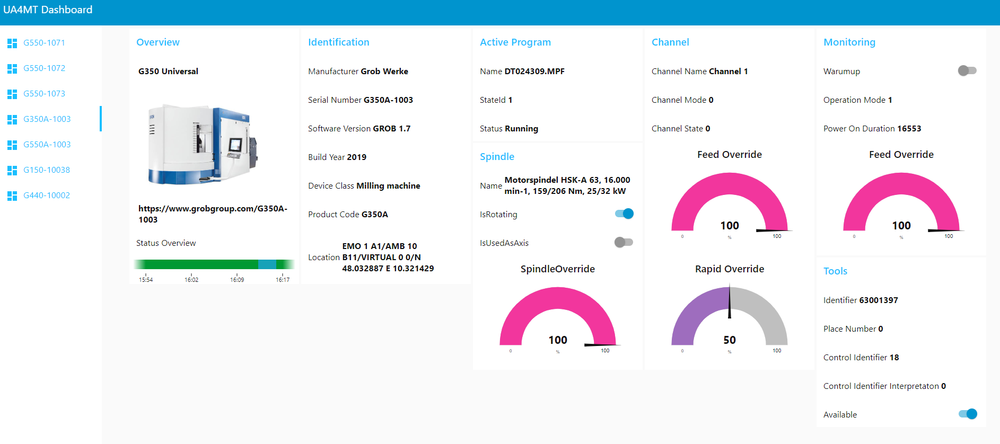
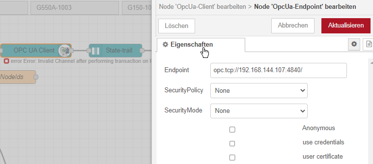
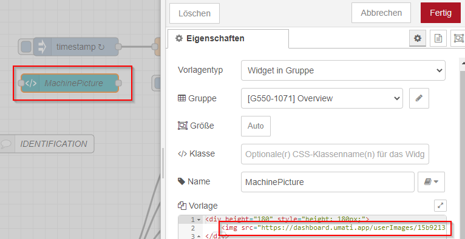
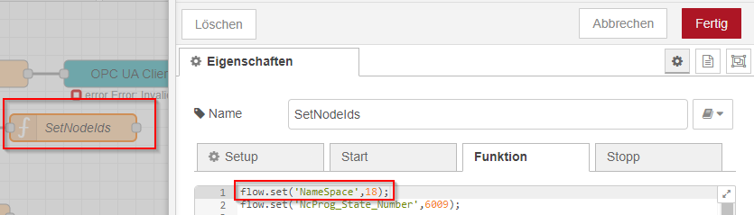
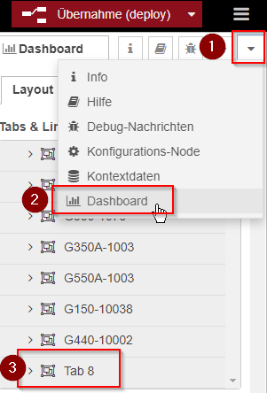
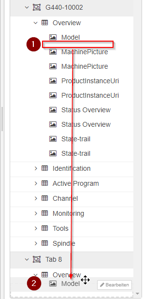

# Node-RED UA4MT-Dashboard

This dashboard is developed with Node-RED. It uses Node-RED OPC UA client and Dashboard elements with a own webserver. So it works fine for on premise installations. It scales well for phone tablet or desktop resolutions. 
Own changes can be done quickly in Node-RED, like adding a new machine to the Dashboard. 

Information displayed:
- Overview with state trail and machine image
- Identification
- Active Program
- Channel
- Monitoring
- Spindle
- Tools

## Dependencies 

- [Node-RED Version 3](https://nodered.org/blog/2022/07/14/version-3-0-released)
- [Node.js](https://nodejs.org/en/)
- [node-red-contrib-opcua](https://flows.nodered.org/node/node-red-contrib-opcua)
- [node-red-contrib-ui-state-trail](https://flows.nodered.org/node/node-red-contrib-ui-state-trail)
- [node-red-dashboard](https://flows.nodered.org/node/node-red-dashboard)

## Run

Setting up Node-RED is explained on the `nodered.org` website:
- [Linux](https://nodered.org/docs/getting-started/local)
- [Windows](https://nodered.org/docs/getting-started/windows)
- Install required Node-RED nodes. Either directly with npm or with the [pallet manager](https://nodered.org/docs/user-guide/editor/palette/manager)
- Run Node-RED as described above at Linux/Windows
- Import (strg+i) the `UA4MT Dashboard.json` from the repository into the Node-RED editor
- **Deploy** changes in the top right corner
- You can then access the Dashboard by pointing your browser at `http://localhost:1880/ui`

## Configure 

### OPC UA Server

Connect to your own OPC UA server by editing the settings of the OpcUA-Client-node
- Double click OpcUA-Client-node
- Click on edit-pencil 
- Set up your own endpoint in the format `opc.tcp://datahub.umati.app:4840`
- Configure basic authentication by checking "use credentials" 

### Machine Image

To setup your own machine image, locate the MachinePicture node. Open configuration and enter the URL to your image:

### Adjust Namespace

The namespace must be configured in order to get the correct data for your machine. Locate the SetNodeIds node and adjust the namespace to your own: 

### Adding new Machine

In order to add a new machine just copy (strg+a, strg+c) an entire flow into a new flow tab. Adjust the namespace like described above. 

Now the copied dashboard elements need to be arranged to the machine. Open the Dashboard configuration and add a new tab and groups for the newly added machine: 

Drag and drop the Dashboard elements from your copied machine to the new machine:

Repeat for the remaining duplicated Dashboard elements and you are done. 

## License 

Unless otherwise specified, source code in this repository is licensed under the [Mozilla Public License v2.0 (MPLv2)](LICENSE).