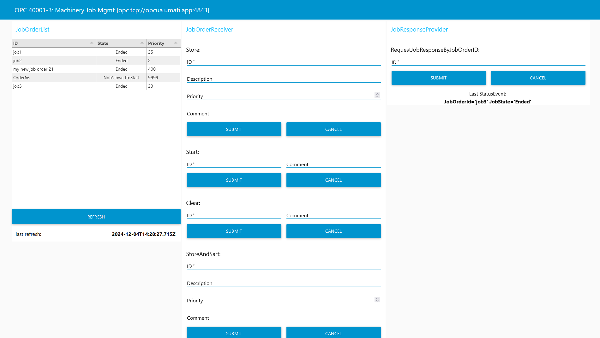
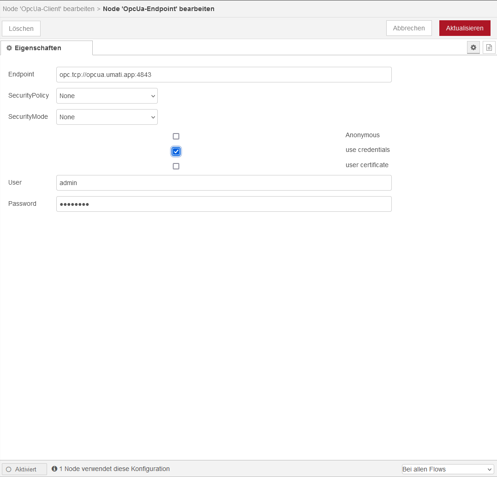
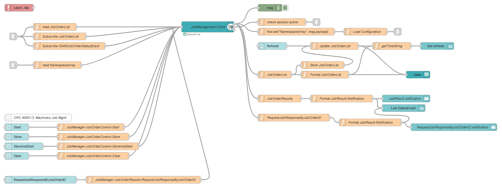
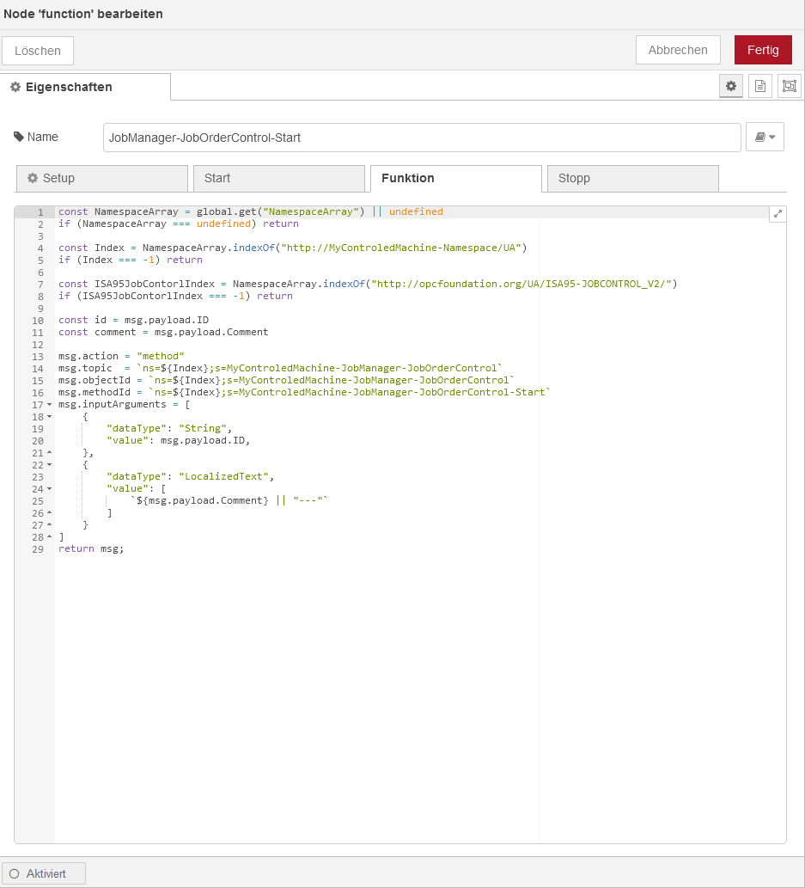

# Machinery Job Mgmt Dashboard

  

This is an example Implementation for a JobManagement-Client using NodeRED and NodeRED Dashboard.  

## Dependencies:  

- [Node-RED Version 3](https://nodered.org/blog/2022/07/14/version-3-0-released)
- [Node.js](https://nodejs.org/en/)
- [node-red-contrib-opcua](https://flows.nodered.org/node/node-red-contrib-opcua) (0.2.339 or newer !!!)
- [node-red-dashboard](https://flows.nodered.org/node/node-red-dashboard)
- [node-red-node-ui-table](https://flows.nodered.org/node/node-red-node-ui-table)

## Client-Configuration:  

  

The whole namespace has some Permissions set, so in order to be able to call the methods you need to login:  
- Username: "admin"    
- Password: "pw1"    

  

## Implementation:  

   

Due to some hardcoded parts of this Application it is ment to be used with the [SampleServer-node-opcua](https://github.com/AndreasHeine/SampleServer-node-opcua) @ opc.tcp://opcua.umati.app:4843  
The implementation is are Namespaceaware!  
Therefore the OPC UA Client reads the NamespaceArray in order to construct the correct NodeId's.  

  